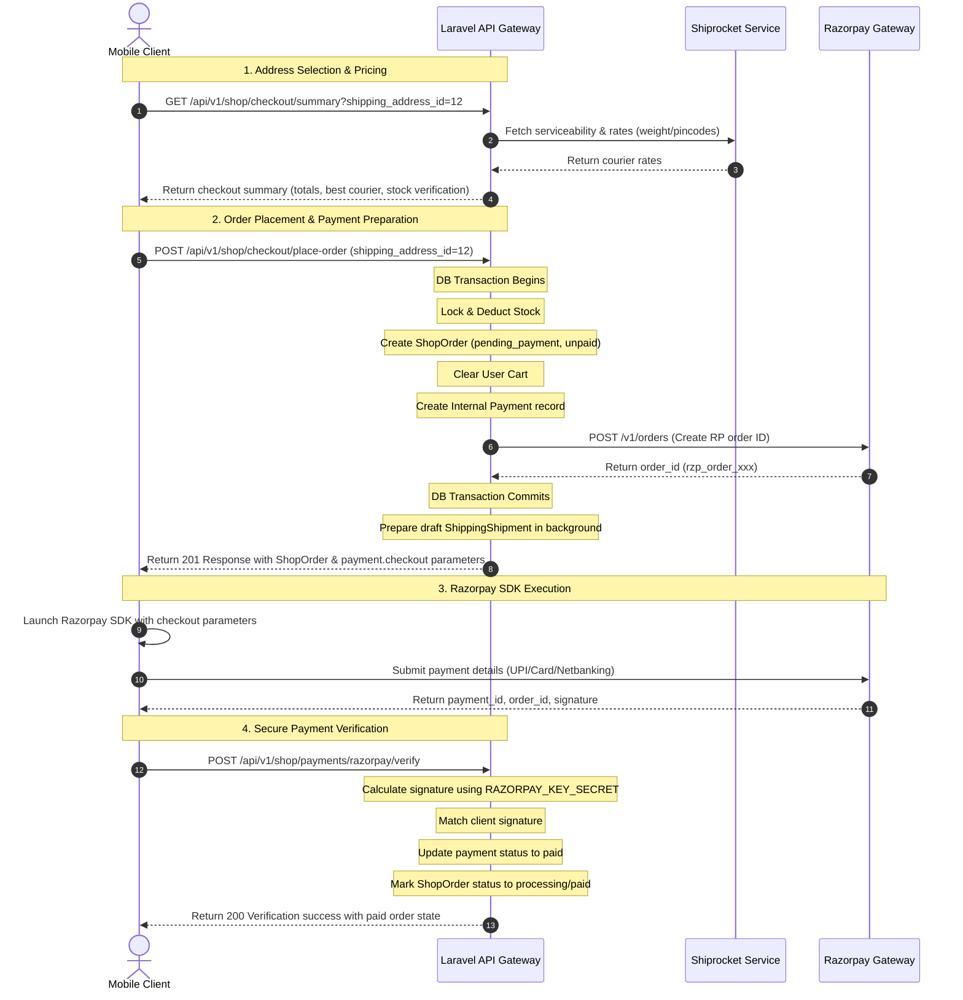

# Executive Cricket Club (ECC) Checkout + Vault Delivery API Handoff Details
## Technical Reference for Mobile (Flutter) and Frontend/Web Developers

This document serves as the complete technical handoff for implementing the shop checkout and vault physical delivery flows on mobile and web clients. It details the routes, data models, payment gateway integration (Razorpay), shipment management (Shiprocket), testing guidelines, and recommendations to bridge the gap between the mobile API and web client flows.

---

## 1. Relevant Routes & Endpoints

All API endpoints are prefixed with `/api/v1` and require header authentication unless specified otherwise:
- **Authorization Header**: `Authorization: Bearer <token>`
- **Content-Type Header**: `Content-Type: application/json`
- **Accept Header**: `Accept: application/json`

### A. Shop, Cart, and Checkout APIs

| HTTP Method | API Path | Auth/Middleware | Controller / Action | Description |
|---|---|---|---|---|
| **GET** | `/api/v1/shop/products` | `auth:api` | `ShopProductController@index` | Get paginated product list with filters. |
| **GET** | `/api/v1/shop/products/{id}` | `auth:api` | `ShopProductController@show` | Get detailed product information. |
| **GET** | `/api/v1/cart` | `auth:api` | `CartController@index` | Retrieve the active user cart, items, prices, and totals. |
| **POST** | `/api/v1/cart/items` | `auth:api` | `CartController@addItem` | Add a product/variant to the cart. |
| **PUT/PATCH** | `/api/v1/cart/items/{id}` | `auth:api` | `CartController@updateItem` | Update item quantity in the cart. |
| **DELETE** | `/api/v1/cart/items/{id}` | `auth:api` | `CartController@removeItem` | Remove a specific item from the cart. |
| **DELETE** | `/api/v1/cart` | `auth:api` | `CartController@clear` | Clear all items in the cart. |
| **GET** | `/api/v1/shop/addresses` | `auth:api` | `AddressController@index` | Fetch the user's shipping/billing address book. |
| **POST** | `/api/v1/shop/addresses` | `auth:api` | `AddressController@store` | Create a new user address. |
| **GET** | `/api/v1/shop/checkout/summary` | `auth:api` | `CheckoutController@summary` | Generate checkout totals, check stock, and retrieve the shipping fee for a selected address. |
| **POST** | `/api/v1/shop/checkout/place-order` | `auth:api` | `CheckoutController@placeOrder` | Create order from cart, allocate inventory, clear cart, and return Razorpay payment payload. |
| **GET** | `/api/v1/shop/orders` | `auth:api` | `ShopOrderController@index` | Fetch paginated past order history. |
| **GET** | `/api/v1/shop/orders/{id}` | `auth:api` | `ShopOrderController@show` | Retrieve order details and shipping/tracking timelines. |
| **POST** | `/api/v1/shop/orders/{id}/cancel` | `auth:api` | `ShopOrderController@cancel` | Cancel an unpaid order and restore inventory. |
| **POST** | `/api/v1/shop/payments/razorpay/verify` | `auth:api` | `RazorpayPaymentController@verify` | Verify mobile client Razorpay signature and mark order/vault request as paid. |

> [!NOTE]
> There is also a legacy mock payment endpoint `POST /api/v1/shop/orders/{id}/confirm-payment` which confirmed payment instantly. **Mobile must avoid this endpoint for production payments** and strictly use `/api/v1/shop/payments/razorpay/verify`.

### B. Vault Physical Delivery APIs

| HTTP Method | API Path | Auth/Middleware | Controller / Action | Description |
|---|---|---|---|---|
| **GET** | `/api/v1/me/vault/summary` | `auth:api` | `VaultController@summary` | Retrieve vault counts (locked vs removed) and check tier access permission. |
| **GET** | `/api/v1/me/vault` | `auth:api` | `VaultController@index` | Fetch the list of vault items (locked/removed) with nested delivery request tracking details. |
| **GET** | `/api/v1/me/vault/{id}` | `auth:api` | `VaultController@show` | Get single vault item details, including active delivery requests and timelines. |
| **GET/POST** | `/api/v1/me/vault/{id}/delivery-quote` | `auth:api` | `VaultController@deliveryQuote` | Calculate Shiprocket courier rates for delivery of a vault item. Takes `address_id` or raw `postal_code`. |
| **POST** | `/api/v1/me/vault/{id}/request-removal` | `auth:api` | `VaultController@requestRemoval` | Initiate a request to deliver a physical vault item to the user's address. |

### C. Web Payments vs API Payments Routes

On the web interface, payments are processed via browser redirections:
- `GET /payments/razorpay/{payment}/pay` (Displays standard Razorpay hosted payment page)
- `POST /payments/razorpay/verify` (Handles browser postback signature validation)
- `GET /payments/razorpay/{payment}/retry` (Initiates a new payment attempt for an unpaid/failed payment)
- `GET /payments/failed` (Payment failure error page)

**Mobile developers must ignore these web routes** and instead integrate the native Razorpay SDK (Standard Checkout) directly using the payment variables (Order ID, Key ID, amount) returned in API responses, then call `/api/v1/shop/payments/razorpay/verify`.

### D. Logistics Webhooks (Internal & Partner APIs)

| HTTP Method | Web Route Path | Auth/Middleware | Controller / Action | Description |
|---|---|---|---|---|
| **POST** | `/webhooks/razorpay` | Signature | `RazorpayWebhookController@handle` | Backend backup to capture payment success if a user closes the application before verification. |
| **POST** | `/webhooks/logistics/tracking` | `x-api-key` header | `LogisticsWebhookController@tracking` | Shiprocket webhook for receiving push notifications of tracking status updates. |

---

## 2. Shop Checkout System Architecture & Flow

The backend handles calculations, payment setup, inventory management, and shipping quotes atomically. The complete checkout transaction sequence is outlined below:



### Critical Rules of Checkout State:
1. **Cart Clearing**: Cart is cleared **during the order creation database transaction** (Step 2), before payment verification. If a user drops off during payment, their cart remains empty, but their order remains accessible in their orders list with a `pending_payment` status.
2. **Inventory Allocation**: Stock is locked and decremented **immediately during order creation** (Step 2). This prevents double-selling (overselling) during checkout. If payment fails or the order is cancelled, inventory is automatically incremented back to stock.
3. **Fulfillment Action**: Manually controlled by the admin. Successful payment verification prepares a draft `ShippingShipment` record with pre-selected courier details, but **does not trigger Shiprocket shipment creation**. The admin must dispatch the shipment from the admin dashboard.

---

## 3. Shop Checkout API Contract

### A. Place Order Request
**Endpoint:** `POST /api/v1/shop/checkout/place-order`

```json
{
  "shipping_address_id": 12,
  "billing_address_id": 12,
  "billing_same_as_shipping": true,
  "notes": "Please deliver in the evening."
}
```

### B. Place Order Success Response
**Status:** `201 Created`

```json
{
  "success": true,
  "message": "Order placed successfully.",
  "data": {
    "id": 45,
    "order_number": "ECC-20260522-8A9F3C",
    "status": "pending_payment",
    "payment_status": "unpaid",
    "currency": "INR",
    "totals": {
      "subtotal": 12500.00,
      "shipping_fee": 150.00,
      "tax_amount": 0.00,
      "discount_amount": 0.00,
      "total_amount": 12650.00
    },
    "shipping_address": {
      "id": 12,
      "user_id": 3,
      "full_name": "Rohan Sharma",
      "phone": "+919876543210",
      "line1": "Flat 405, Grand Pavilion",
      "line2": "Cricket Stadium Road",
      "city": "Mumbai",
      "state": "Maharashtra",
      "postal_code": "400001",
      "country": "India",
      "type": "shipping"
    },
    "billing_address": {
      "id": 12,
      "user_id": 3,
      "full_name": "Rohan Sharma",
      "phone": "+919876543210",
      "line1": "Flat 405, Grand Pavilion",
      "line2": "Cricket Stadium Road",
      "city": "Mumbai",
      "state": "Maharashtra",
      "postal_code": "400001",
      "country": "India",
      "type": "shipping"
    },
    "items": [
      {
        "id": 98,
        "product_id": 4,
        "title": "ECC English Willow Bat - Grade 1",
        "quantity": 1,
        "unit_price": 12500.00,
        "line_total": 12500.00,
        "variations": [
          {
            "id": 15,
            "caption": "Short Handle"
          }
        ]
      }
    ],
    "dates": {
      "placed_at": "2026-05-22T10:45:00+01:00",
      "paid_at": null,
      "cancelled_at": null
    },
    "notes": "Please deliver in the evening.",
    "shipment": {
      "available": true,
      "status": "courier_selected",
      "status_label": "Courier Selected",
      "courier_name": "Delhivery Direct",
      "shipping_charge": 150.00,
      "currency": "INR",
      "estimated_delivery_days": 3,
      "etd": "May 25, 2026",
      "events": []
    },
    "payment": {
      "id": 182,
      "gateway": "razorpay",
      "status": "initiated",
      "amount": 12650.00,
      "currency": "INR",
      "checkout": {
        "gateway": "razorpay",
        "key": "rzp_test_xxxxxxxxxxxxxx",
        "amount": 1265000,
        "display_amount": 12650.00,
        "currency": "INR",
        "order_id": "order_PJk193kdksa",
        "internal_payment_id": 182,
        "name": "Executive Cricket Club",
        "description": "Executive Cricket Club - Shop Order",
        "prefill": {
          "name": "Rohan Sharma",
          "email": "rohan@example.com",
          "contact": "+919876543210"
        },
        "notes": {
          "internal_payment_id": 182,
          "payment_id": 182,
          "purpose": "shop_order"
        }
      }
    }
  },
  "meta": null,
  "errors": null
}
```

### C. Error Response Samples

#### Unauthenticated Request (JWT Expired/Missing)
*Status: 401 Unauthorized*
```json
{
  "message": "Unauthenticated."
}
```

#### Validation Error (e.g. Address Invalid)
*Status: 422 Unprocessable Content*
```json
{
  "message": "The shipping address id field is required.",
  "errors": {
    "shipping_address_id": [
      "The shipping address id field is required."
    ]
  }
}
```

#### Out of Stock
*Status: 409 Conflict*
```json
{
  "success": false,
  "message": "Insufficient stock for Short Handle. Requested: 2, Available: 1",
  "data": null,
  "meta": null,
  "errors": "Insufficient stock for Short Handle. Requested: 2, Available: 1"
}
```

#### Shipping Quote Unavailable (e.g., Unserviceable Pincode)
*Status: 500 Internal Server Error*
```json
{
  "success": false,
  "message": "Shipping is not available for this address.",
  "data": null,
  "meta": null,
  "errors": "Shipping is not available for this address."
}
```

### D. Mobile SDK Implementation Notes

> [!IMPORTANT]
> - **Display Backend Totals Only**: The mobile client must never calculate totals (subtotal + shipping) dynamically. Display `totals.total_amount` returned by the backend.
> - **Razorpay SDK Input**: Pass `payment.checkout.amount` (value in **paise**) to the Razorpay SDK configuration parameters.
> - **Verification Obligation**: Do not trust the Razorpay SDK's success callback to immediately finalize order delivery. The client **must** send the signature payload to `/verify` to finalize order status.

---

## 4. Razorpay Mobile Payment Verify API Contract

**Endpoint:** `POST /api/v1/shop/payments/razorpay/verify`

### A. Verification Request Payload
The mobile client must extract these keys from the Razorpay SDK success response and pass them alongside the internal payment ID:

```json
{
  "payment_id": 182,
  "razorpay_order_id": "order_PJk193kdksa",
  "razorpay_payment_id": "pay_PJk289sjdhkj",
  "razorpay_signature": "7f8b901a89c8911dd12a2307efcfdf88998abce7b8c8d89e90ff011122a2bb43"
}
```

### B. Success Response Payload
*Status: 200 OK*

```json
{
  "success": true,
  "message": "Payment verified successfully.",
  "data": {
    "payment": {
      "id": 182,
      "gateway": "razorpay",
      "status": "paid",
      "amount": 12650.00,
      "currency": "INR",
      "gateway_order_id": "order_PJk193kdksa",
      "gateway_payment_id": "pay_PJk289sjdhkj",
      "paid_at": "2026-05-22T10:46:15+01:00"
    },
    "order": {
      "id": 45,
      "order_number": "ECC-20260522-8A9F3C",
      "status": "paid",
      "payment_status": "paid",
      "currency": "INR",
      "totals": {
        "subtotal": 12500.00,
        "shipping_fee": 150.00,
        "tax_amount": 0.00,
        "discount_amount": 0.00,
        "total_amount": 12650.00
      },
      "shipping_address": { ... },
      "billing_address": { ... },
      "items": [ ... ],
      "dates": {
        "placed_at": "2026-05-22T10:45:00+01:00",
        "paid_at": "2026-05-22T10:46:15+01:00",
        "cancelled_at": null
      },
      "notes": "Please deliver in the evening.",
      "shipment": {
        "available": true,
        "status": "courier_selected",
        "status_label": "Courier Selected",
        "courier_name": "Delhivery Direct",
        "shipping_charge": 150.00,
        "currency": "INR"
      }
    }
  },
  "meta": null,
  "errors": null
}
```

### C. Verification Error Response Samples

#### Signature Mismatch / Tampered Request
*Status: 422 Unprocessable Content*
```json
{
  "success": false,
  "message": "Payment verification failed.",
  "data": null,
  "meta": null,
  "errors": {
    "payment": [
      "Invalid payment signature."
    ]
  }
}
```

#### Unauthorized Verification Attempt (Payment Belongs to Another User)
*Status: 403 Forbidden*
```json
{
  "success": false,
  "message": "Unauthorized access to payment.",
  "data": null,
  "meta": null,
  "errors": null
}
```

---

## 5. Shop Order Detail + Tracking API Contract

**Endpoint:** `GET /api/v1/shop/orders/{id}`

### A. Order Detail Response - Shipment Prepared (Before Dispatch)
*Status: 200 OK*
```json
{
  "success": true,
  "message": "Order details fetched successfully.",
  "data": {
    "id": 45,
    "order_number": "ECC-20260522-8A9F3C",
    "status": "paid",
    "payment_status": "paid",
    "currency": "INR",
    "totals": {
      "subtotal": 12500.00,
      "shipping_fee": 150.00,
      "tax_amount": 0.00,
      "discount_amount": 0.00,
      "total_amount": 12650.00
    },
    "shipping_address": { ... },
    "items": [ ... ],
    "dates": {
      "placed_at": "2026-05-22T10:45:00+01:00",
      "paid_at": "2026-05-22T10:46:15+01:00",
      "cancelled_at": null
    },
    "notes": "Please deliver in the evening.",
    "shipment": {
      "available": true,
      "status": "courier_selected",
      "status_label": "Courier Selected",
      "status_badge_class": "bg-info-subtle text-info",
      "courier_name": "Delhivery Direct",
      "awb_code": null,
      "tracking_url": null,
      "shipping_charge": 150.00,
      "currency": "INR",
      "estimated_delivery_days": 3,
      "etd": "May 25, 2026",
      "initiated_at": null,
      "last_tracked_at": null,
      "is_test_mode": false,
      "documents": {
        "invoice_available": false,
        "invoice_url": null
      },
      "events": []
    }
  },
  "meta": null,
  "errors": null
}
```

### B. Order Detail Response - Shipped & In Transit (With Tracking Events)
*Status: 200 OK*
```json
{
  "success": true,
  "message": "Order details fetched successfully.",
  "data": {
    "id": 45,
    "order_number": "ECC-20260522-8A9F3C",
    "status": "shipped",
    "payment_status": "paid",
    "currency": "INR",
    "totals": { ... },
    "shipping_address": { ... },
    "items": [ ... ],
    "dates": {
      "placed_at": "2026-05-22T10:45:00+01:00",
      "paid_at": "2026-05-22T10:46:15+01:00",
      "cancelled_at": null
    },
    "shipment": {
      "available": true,
      "status": "in_transit",
      "status_label": "In Transit",
      "status_badge_class": "bg-primary-subtle text-primary",
      "courier_name": "Delhivery Direct",
      "awb_code": "DEL9381736192",
      "tracking_url": "https://track.delhivery.com/awb/DEL9381736192",
      "shipping_charge": 150.00,
      "currency": "INR",
      "estimated_delivery_days": 3,
      "etd": "May 25, 2026",
      "initiated_at": "2026-05-23T09:00:00+01:00",
      "last_tracked_at": "2026-05-24T12:00:00+01:00",
      "is_test_mode": false,
      "documents": {
        "invoice_available": true,
        "invoice_url": "https://ecc-shipping-invoices.s3.amazonaws.com/orders/inv_45.pdf"
      },
      "events": [
        {
          "status": "in_transit",
          "status_label": "In Transit",
          "description": "Shipment departed from Mumbai Hub.",
          "location": "Mumbai Warehouse",
          "event_time": "2026-05-24T08:30:00+01:00"
        },
        {
          "status": "picked_up",
          "status_label": "Picked Up",
          "description": "Courier picked up the parcel from the facility.",
          "location": "Delhi Main Warehouse",
          "event_time": "2026-05-23T14:00:00+01:00"
        },
        {
          "status": "awb_assigned",
          "status_label": "AWB Assigned",
          "description": "AWB code DEL9381736192 assigned.",
          "location": "System Office",
          "event_time": "2026-05-23T09:15:00+01:00"
        }
      ]
    }
  },
  "meta": null,
  "errors": null
}
```

---

## 6. Vault Physical Delivery Request Flow

The Vault physical delivery process allows members to withdraw items stored in their digital vault and have them shipped to a physical address.

### The Business Sequence:
1. **Quote Phase**: User requests a shipping estimate. Pincode serviceability checks are run against the package weight and dimensions stored in the system.
2. **Request Submission**: User submits the request. The request is created in the database.
3. **Payment Phase**: The user pays the calculated delivery charge via Razorpay.
4. **Admin Review Phase**: Once paid, the request status is set to `pending` (which displays to the administrator as "Pending Review").
5. **Shipment Preparation**: The admin reviews the request, verifies physical item availability, and clicks "Approve". 
6. **Dispatch**: The admin initiates the Shiprocket dispatch manually from the admin dashboard.

---

## 7. Vault Delivery API Contract

### A. Generate Quote (Required Step)
Before requesting delivery, retrieve the shipping quote for the item to ensure serviceability.
- **Endpoint:** `POST /api/v1/me/vault/{id}/delivery-quote`
- **Request Payload:**
```json
{
  "address_id": 12
}
```
*Note: If the user wants to test a raw postcode without using a saved address, pass `"postal_code": "400001"` instead of `address_id`.*

- **Success Response (200 OK):**
```json
{
  "success": true,
  "message": "Delivery quote retrieved successfully.",
  "data": {
    "success": true,
    "message": "Delivery quote calculated.",
    "delivery_fee": 150.00,
    "currency": "INR",
    "pickup_pincode": "110001",
    "delivery_pincode": "400001",
    "payment_mode": "prepaid",
    "measurement": {
      "weight_kg": 0.5,
      "length_cm": 10.00,
      "breadth_cm": 10.00,
      "height_cm": 10.00,
      "volumetric_weight_kg": 0.17,
      "chargeable_weight_kg": 0.5,
      "source": "default",
      "has_fallback": true
    },
    "selected_courier": {
      "courier_company_id": "12",
      "courier_name": "Delhivery Direct",
      "rating": 4.5,
      "freight_charge": 150.00,
      "cod_charge": 0.00,
      "total_charge": 150.00,
      "etd": "2026-05-28",
      "estimated_delivery_days": 3
    },
    "rate_quote_id": 142
  }
}
```

### B. Submit Delivery Request
- **Endpoint:** `POST /api/v1/me/vault/{id}/request-removal`
- **Request Payload:**
```json
{
  "address_id": 12,
  "message": "Please pack with extra protection."
}
```

- **Success Response (201 Created):**
```json
{
  "success": true,
  "message": "Physical delivery request submitted successfully.",
  "data": {
    "request_id": 5,
    "status": "pending",
    "delivery_address": {
      "name": "Rohan Sharma",
      "phone": "+919876543210",
      "line1": "Flat 405, Grand Pavilion",
      "city": "Mumbai",
      "state": "Maharashtra",
      "postal_code": "400001",
      "country": "India"
    }
  },
  "meta": null,
  "errors": null
}
```

---

> [!WARNING]
> ### 🛑 Critical API Gap Details & Workaround Instructions
> 
> When calling `POST /api/v1/me/vault/{id}/request-removal` in the API, the backend executes the service class `VaultService@requestRemoval` **without passing the quote data**.
>
> **The Problem:**
> Because no quote is passed, the removal request is created with `delivery_fee = null` and `payment_status = none`. Consequently, the request bypasses payment requirements, allowing the admin to approve and ship the item for free.
> 
> **How Web Side Handles This:**
> The Web Livewire component calculates the quote, stores the metadata, calls the service method *with* `$quoteData`, and then redirects to the checkout page: `redirect(route('shop.checkout', ['vault_request_id' => $createdRequest->id]))`.
>
> The checkout page calls `PaymentManager->initiatePayment` which creates the payment object and redirects to Razorpay.
> 
> **Mobile Handoff Instructions & Retrofit Recommendation:**
> Since we must not modify business logic to avoid breaking existing clients, we recommend the following backward-compatible API modification to the backend team:
> 
> #### Recommended Addition to `/api/v1/me/vault/{id}/request-removal`
> Modify the API controller to accept a `rate_quote_id` and a `payment_gateway` parameter, calculate/apply the fee, and return the initiated payment details inside the response envelope.
>
> **Proposed Request Format:**
> ```json
> {
>   "address_id": 12,
>   "rate_quote_id": 142,
>   "payment_gateway": "razorpay",
>   "message": "Please pack carefully"
> }
> ```
> 
> **Proposed Success Response Format:**
> ```json
> {
>   "success": true,
>   "message": "Removal requested and payment initiated.",
>   "data": {
>     "request_id": 5,
>     "status": "pending",
>     "delivery_address": { ... },
>     "payment": {
>       "id": 183,
>       "gateway": "razorpay",
>       "status": "initiated",
>       "amount": 150.00,
>       "currency": "INR",
>       "checkout": {
>         "gateway": "razorpay",
>         "key": "rzp_test_xxxxxxxxxx",
>         "amount": 15000,
>         "order_id": "order_VaultPJk231d",
>         "internal_payment_id": 183
>       }
>     }
>   }
> }
> ```

---

### C. Vault Delivery Request Status & Tracking (Item Detail)
Fulfillment status and timelines can be retrieved by inspecting the `delivery_request` object inside the Vault Item Detail endpoint:
- **Endpoint:** `GET /api/v1/me/vault/{id}`

- **Success Response Sample (Item Requested, Paid, and Shipped):**
*Status: 200 OK*
```json
{
  "success": true,
  "message": "Vault item details fetched.",
  "data": {
    "id": 8,
    "status": "removed",
    "locked_at": "2026-01-10T12:00:00+01:00",
    "removed_at": "2026-05-24T15:00:00+01:00",
    "display": {
      "title": "Vintage Cricket Ledger - Signed by Legends",
      "subtitle": "INR 45,000.00",
      "ref": "VL-1983-09A",
      "currency": "INR",
      "total_value": "45000.00",
      "has_pending_request": false
    },
    "delivery_request": {
      "id": 5,
      "status": "delivered",
      "status_label": "Delivered",
      "payment_status": "paid",
      "payment_status_label": "Paid",
      "delivery_fee": 150.00,
      "delivery_currency": "INR",
      "courier_name": "Delhivery Direct",
      "awb_code": "DEL9982312",
      "tracking_url": "https://track.delhivery.com/awb/DEL9982312",
      "is_test_mode": false,
      "initiated_at": "2026-05-23T10:00:00+01:00",
      "last_tracked_at": "2026-05-24T15:00:00+01:00",
      "events": [
        {
          "status": "delivered",
          "status_label": "Delivered",
          "description": "Item successfully delivered to the customer.",
          "location": "Mumbai Office",
          "event_time": "2026-05-24T14:45:00+01:00"
        },
        {
          "status": "in_transit",
          "status_label": "In Transit",
          "description": "Parcel departed facility.",
          "location": "Mumbai Sorting Hub",
          "event_time": "2026-05-23T18:20:00+01:00"
        },
        {
          "status": "paid",
          "status_label": "Delivery Fee Paid",
          "description": "Payment has been processed successfully.",
          "location": "Secure Checkout",
          "event_time": "2026-05-22T11:00:00+01:00"
        },
        {
          "status": "requested",
          "status_label": "Delivery Requested",
          "description": "Delivery request submitted to the vault administration.",
          "location": "Digital Vault",
          "event_time": "2026-05-22T10:48:00+01:00"
        }
      ]
    }
  }
}
```

---

## 8. Shiprocket Courier & Serviceability Rules

### A. Courier Selection Logic
The backend queries Shiprocket serviceability for the configured pickup warehouse pincode and the recipient delivery pincode. Available courier providers are sorted automatically by the system using these rules:
1. **Courier Rating**: Best-rated courier chosen first (`rating` descending).
2. **Total Shipping Cost**: If ratings are equal, the lowest priced option is chosen (`total_charge` ascending).
3. **Estimated Delivery Date (ETD)**: If price is equal, the courier with the fastest transit time is chosen (`estimated_delivery_days` ascending).

### B. Package Dimensions Calculations
Dimensions are calculated dynamically based on the items in the cart:
- If a product or variant has custom dimensions (weight, length, width, height) defined on the model, the system compiles them.
- If dimensions are missing, the system uses the default fallback configurations:
  - **Weight**: 0.5 kg
  - **Length / Breadth / Height**: 10.00 cm

---

## 9. Status & Screen Mapping Matrix

For a consistent user experience, map order and shipment states to the following layouts on the mobile client:

### Shop Orders
| Internal State (`status` / `payment_status`) | Delivery Status (`shipment.status`) | Mobile Display Status | Allowed Client Action | Screen Widget / Component |
|---|---|---|---|---|
| `pending_payment` / `unpaid` | N/A | Awaiting Payment | Pay Now / Cancel Order | Checkout / Payment SDK |
| `pending_payment` / `payment_failed` | N/A | Payment Failed | Retry Payment | Failure screen with Try Again button |
| `paid` / `paid` | `courier_selected` | Preparing Package | Contact Support | Order Details (Timeline: Ordered → Paid) |
| `processing` / `paid` | `created` or `awb_assigned` | Dispatching soon | Track Order (disabled) | Timeline showing AWB allocation |
| `shipped` / `paid` | `in_transit` | In Transit | Track Shipment / Invoice | Map view / Event timeline / Invoice link |
| `delivered` / `paid` | `delivered` | Delivered | Return Request / Support | Receipt / Green Badge / Completion screen |
| `cancelled` / `unpaid` | N/A | Cancelled | Reorder Items | Greyed out status badge |

### Vault Deliveries
| Internal State (`status` / `payment_status`) | Display Status (`status_label`) | timeline Milestone events | Allowed Client Action | Screen Widget / Component |
|---|---|---|---|---|
| `pending` / `pending_payment` | Awaiting Delivery Payment | Requested | Pay Delivery Fee | Payment retry button |
| `pending` / `paid` | Awaiting Admin Review | Requested → Paid | Contact Support | Status timeline showing Paid |
| `rejected` / `refund_required` | Rejected — Refund Required | Requested → Paid → Rejected | Contact Support | Warning Banner: Refund processing |
| `approved` / `paid` | Approved, Preparing Shipment | Requested → Paid → Approved | Track Order (disabled) | Loading state |
| `completed` / `paid` | Shipped or Delivered | Timeline + Shiprocket events | Track Shipment / Invoice | Timeline tracking event widget |

---

## 10. Retry Payment Mechanism

If a user abandons checkout, encounters a bank page failure, or closes their app, they can retry payment later from their order history without placing duplicate orders.

### The Sequence:
1. Mobile requests a new payment session using the original Payment ID.
2. The backend generates a **new Payment record (attempt)** in the database.
3. The new Payment record is linked to the same order entity.
4. The backend requests a new Razorpay Order ID and returns updated standard checkout details to the client.

### Recommendations for the Mobile API:
There is currently no API-specific endpoint to initiate a retry. We recommend the backend team expose the following endpoint for the mobile application:

**Recommended Route:**
`POST /api/v1/shop/payments/{payment_id}/retry`

**Example Request Payload:**
```json
{
  "payment_gateway": "razorpay"
}
```

**Response Payload:**
Returns a fresh `payment` object containing the `checkout` parameters (including the new `order_id` in paise), mirroring the Place Order success payload.

---

## 11. Razorpay Webhooks vs Client Verification

### Webhook Event Details:
The backend supports webhook processing via `POST /webhooks/razorpay`.
- Validated using the `X-Razorpay-Signature` header and the `RAZORPAY_WEBHOOK_SECRET` environment variable.
- Supported events:
  - `payment.captured`
  - `order.paid`
  - `payment.failed`

### The Sandbox Testing Reality:
While the backend webhook controller is fully implemented, **webhooks cannot be tested inside a local development/emulator environment without a tunneling tool** (e.g., ngrok) and configuring the webhook URL in the Razorpay Dashboard.

### Mobile Client Workaround:
Mobile clients must not depend on webhooks to transition order screens. Instead, rely on direct client verification:
1. Perform transaction via Razorpay Mobile SDK.
2. Catch the SDK success callback (provides payment details).
3. POST the payment details immediately to `/api/v1/shop/payments/razorpay/verify`.
4. Render the order confirmation screen upon receiving the API's success response.
5. The webhook serves as a backend-to-backend backup in case the application crashes before step 3.

---

## 12. Complete Mobile Flow Step-by-Step

### Flow A: Successful Shop Order Placement & Payment
1. **Retrieve Checkout Info**: Client calls `GET /api/v1/shop/checkout/summary?shipping_address_id=12`.
2. **Submit Order**: User clicks "Place Order". Client posts to `/api/v1/shop/checkout/place-order`.
   - Backend returns `201 Created` with a new `ShopOrder` object and payment checkout parameters.
3. **Launch Payment**: SDK opens using `payment.checkout` values.
4. **Collect Callback**: SDK finishes with success. Client receives `razorpay_payment_id`, `razorpay_order_id`, and `razorpay_signature`.
5. **Verify Signature**: Client calls `/api/v1/shop/payments/razorpay/verify` with the payload.
6. **Confirmation Screen**: Upon receiving a `success: true` response, render the success/order confirmation screen.

### Flow B: Retry Shop Order Payment
1. **Navigate to Order**: User goes to Order Details screen for a `pending_payment` order.
2. **Click Pay**: User clicks "Pay Now".
3. **Request Session**: Client posts to `/api/v1/shop/payments/{payment_id}/retry`.
   - Backend returns new checkout details.
4. **Launch Payment**: SDK opens with the new session parameters.
5. **Verify Signature**: Post the signature to the verify endpoint.

---

## 13. API Error Code Reference

| HTTP Status | Error Category / Condition | Response Body Sample | Display Guidelines for Mobile Client |
|---|---|---|---|
| **401** | Unauthenticated | `{"message": "Unauthenticated."}` | Clear user session, redirect to Login screen. |
| **422** | Invalid Input / Form validation | `{"message": "The shipping address id field is required.", "errors": {"shipping_address_id": [...]}}` | Render red validation labels below corresponding input fields. |
| **409** | Out of stock | `{"success": false, "message": "Insufficient stock for Short Handle..."}` | Display inline alert banner: "Item stock was updated. Please adjust your cart." |
| **403** | Unauthorized access to resource | `{"success": false, "message": "Unauthorized access to payment."}` | Alert dialog: "Unauthorized action. Please re-login." |
| **500** | Shipping unserviceable | `{"success": false, "message": "Shipping is not available for this address."}` | Banner alert: "Delivery is unserviceable at this address. Please choose another pincode." |
| **422** | Razorpay Verification Signature Mismatch | `{"success": false, "message": "Payment verification failed."}` | Failure screen: "Payment authenticity check failed. Please check your bank transaction or contact support." |

---

## 14. Testing Instructions & Configuration Checklist

### Razorpay Testing Parameters:
- Set Razorpay to **Test Mode**.
- **UPI Test ID (Success)**: `success@razorpay` (Simulates instant successful verification)
- **UPI Test ID (Failure)**: `failure@razorpay` (Simulates an instant bank reject)
- **Card Testing**: Card payments may fail or prompt OTP depending on sandbox account configuration; use UPI IDs for consistent testing.

### Shiprocket Testing Parameters:
- **Test Mode Pincode**: Use `400001` (Mumbai) or `110001` (Delhi).
- **Default Warehouse Pickup**: `110001`.
- **Dimensions**: Weight: `0.5kg`, Volume: `10x10x10cm`.

### Environment Configuration Variables (`.env`):
Verify these keys are set in your local server config:
```bash
# Gateway configurations
PAYMENT_DEFAULT_GATEWAY=razorpay
PAYMENT_DEFAULT_CURRENCY=INR
RAZORPAY_KEY_ID=rzp_test_xxxxxxxxxx
RAZORPAY_KEY_SECRET=xxxxxxxxxxxxxxxxxxxxx
RAZORPAY_WEBHOOK_SECRET=xxxxxxxxxxxxxxxxx

# Shipping configurations
SHIPROCKET_EMAIL=developer@ecc.com
SHIPROCKET_PASSWORD=xxxxxxxxxxxxx
SHIPROCKET_PICKUP_PINCODE=110001
SHIPROCKET_TEST_MODE=true
SHIPROCKET_LIVE_SHIPMENT_ENABLED=false
```
