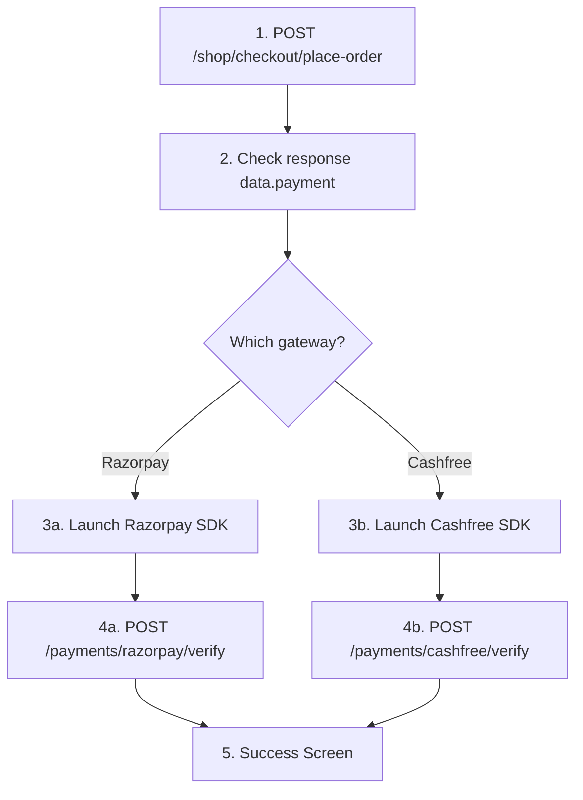

# Mobile Payment Integration Flow & API Reference

This document provides a comprehensive step-by-step reference for mobile client developers implementing payment flows in the Executive Club Cricket (ECC) application.

---

## Part 1: Shared API Endpoints & Payloads

### 1. Discovery: Get Allowed Gateways
Before presenting payment options to the user, fetch the available gateways for the corresponding checkout purpose.

*   **Method:** `GET`
*   **URI:** `/api/v1/payments/gateways?purpose={purpose}`
*   **Authentication:** Required (`Bearer {token}`)
*   **Query Parameters:**
    *   `purpose` (string, required): One of `shop_order`, `membership_upgrade`, `membership_renewal`, `vault_delivery`.

#### Success Response (200 OK)
```json
{
  "success": true,
  "message": "Payment gateways retrieved successfully.",
  "data": {
    "default_gateway": "razorpay",
    "gateways": [
      {
        "key": "razorpay",
        "label": "Razorpay",
        "description": "Pay using UPI, cards, netbanking and wallets.",
        "enabled": true
      },
      {
        "key": "cashfree",
        "label": "Cashfree",
        "description": "Pay using Cashfree supported methods.",
        "enabled": true
      }
    ]
  },
  "meta": null,
  "errors": null
}
```

#### Error: Validation Failed / Invalid Purpose (422 Unprocessable Content)
```json
{
  "success": false,
  "message": "Validation failed: The selected purpose is invalid.",
  "data": null,
  "meta": null,
  "errors": {
    "purpose": [
      "The selected purpose is invalid."
    ]
  }
}
```

---

### 2. Payment Status Polling
Used to recover transaction status on app restart, network drop, or long-running pending states.

*   **Method:** `GET`
*   **URI:** `/api/v1/payments/{id}`
*   **Authentication:** Required (`Bearer {token}`)

#### Success Response (200 OK) - Status: Paid
```json
{
  "success": true,
  "message": "Payment status retrieved successfully.",
  "data": {
    "id": 204,
    "gateway": "razorpay",
    "status": "paid",
    "amount": 500.00,
    "currency": "INR",
    "purpose": "shop_order",
    "verify_endpoint": "https://api.ecc.com/api/v1/payments/razorpay/verify",
    "checkout": null,
    "gateway_order_id": "order_Hj23nsD89s2",
    "gateway_payment_id": "pay_Kjs823hs91s",
    "paid_at": "2026-05-31T22:04:10.000000Z"
  },
  "meta": null,
  "errors": null
}
```

#### Success Response (200 OK) - Status: Failed
```json
{
  "success": true,
  "message": "Payment status retrieved successfully.",
  "data": {
    "id": 204,
    "gateway": "razorpay",
    "status": "failed",
    "amount": 500.00,
    "currency": "INR",
    "purpose": "shop_order",
    "verify_endpoint": "https://api.ecc.com/api/v1/payments/razorpay/verify",
    "checkout": null,
    "gateway_order_id": "order_Hj23nsD89s2",
    "gateway_payment_id": null,
    "paid_at": null
  },
  "meta": null,
  "errors": null
}
```

#### Error: Unauthorized Access (403 Forbidden)
*(When attempting to view another user's payment)*
```json
{
  "success": false,
  "message": "Unauthorized access to payment.",
  "data": null,
  "meta": null,
  "errors": null
}
```

#### Error: Payment Not Found (404 Not Found)
```json
{
  "success": false,
  "message": "Payment not found.",
  "data": null,
  "meta": null,
  "errors": null
}
```

---

### 3. Payment Retry
If a transaction fails or expires, call this to generate a new transaction session for the same order/upgrade.

*   **Method:** `POST`
*   **URI:** `/api/v1/payments/{id}/retry`
*   **Authentication:** Required (`Bearer {token}`)

#### Success Response (200 OK) - Spawns a New Initiated Payment
```json
{
  "success": true,
  "message": "Payment retry initiated successfully.",
  "data": {
    "id": 206,
    "gateway": "razorpay",
    "status": "initiated",
    "amount": 500.0,
    "currency": "INR",
    "purpose": "shop_order",
    "verify_endpoint": "https://api.ecc.com/api/v1/payments/razorpay/verify",
    "checkout": {
      "key": "rzp_test_key_123",
      "order_id": "order_NewRetryOrderId456",
      "amount": 50000,
      "currency": "INR"
    },
    "gateway_order_id": "order_NewRetryOrderId456",
    "gateway_payment_id": null,
    "paid_at": null
  },
  "meta": null,
  "errors": null
}
```

#### Error: Cannot Retry Paid Payments (400 Bad Request)
```json
{
  "success": false,
  "message": "Cannot retry a completed payment.",
  "data": null,
  "meta": null,
  "errors": null
}
```

#### Error: Cannot Retry Processing Payments (400 Bad Request)
```json
{
  "success": false,
  "message": "Cannot retry a payment that is still processing/pending.",
  "data": null,
  "meta": null,
  "errors": null
}
```

---

## Part 2: Step-by-Step Use Cases

### USE CASE 1 — SHOP CHECKOUT



#### Step 1: Place Order & Initiate Payment
*   **Method:** `POST`
*   **URI:** `/api/v1/shop/checkout/place-order`
*   **Authentication:** Required (`Bearer {token}`)
*   **Request Payload:**
```json
{
  "shipping_address_id": 12,
  "billing_address_id": 12,
  "billing_same_as_shipping": true,
  "notes": "Please deliver in afternoon.",
  "payment_gateway": "razorpay"
}
```

##### Success Response (201 Created)
```json
{
  "success": true,
  "message": "Order placed successfully.",
  "data": {
    "id": 45,
    "order_number": "ORD-2026-00912",
    "status": "pending_payment",
    "payment_status": "unpaid",
    "currency": "INR",
    "totals": {
      "subtotal": 500.00,
      "shipping_fee": 0.00,
      "tax_amount": 0.00,
      "discount_amount": 0.00,
      "total_amount": 500.00
    },
    "payment": {
      "id": 204,
      "gateway": "razorpay",
      "status": "initiated",
      "amount": 500.00,
      "currency": "INR",
      "purpose": "shop_order",
      "verify_endpoint": "https://api.ecc.com/api/v1/payments/razorpay/verify",
      "checkout": {
        "key": "rzp_test_key_123",
        "order_id": "order_Hj23nsD89s2",
        "amount": 50000,
        "currency": "INR",
        "name": "Executive Club Cricket",
        "description": "Shop Order #ORD-2026-00912",
        "prefill": {
          "name": "Jane Doe",
          "email": "jane@example.com",
          "contact": "+919876543210"
        }
      },
      "gateway_order_id": "order_Hj23nsD89s2",
      "gateway_payment_id": null,
      "paid_at": null
    }
  },
  "meta": null,
  "errors": null
}
```

##### Error: Out of Stock (409 Conflict)
```json
{
  "success": false,
  "message": "Some items in your cart are no longer available in the requested quantity.",
  "data": null,
  "meta": null,
  "errors": null
}
```

##### Error: Gateway Disabled (422 Unprocessable Content)
```json
{
  "success": false,
  "message": "Selected payment gateway is not available.",
  "data": null,
  "meta": null,
  "errors": {
    "payment_gateway": [
      "Razorpay is not available for checkout yet."
    ]
  }
}
```

#### Step 2: Launch SDK
- Extract `data.payment.checkout` and pass to Razorpay or Cashfree SDK options directly.

#### Step 3: Verify Payment
Upon receiving a successful callback from the mobile SDK, immediately call the verification endpoint:

##### Razorpay Verification
*   **Method:** `POST`
*   **URI:** `/api/v1/payments/razorpay/verify`
*   **Payload:**
```json
{
  "payment_id": 204,
  "razorpay_order_id": "order_Hj23nsD89s2",
  "razorpay_payment_id": "pay_Kjs823hs91s",
  "razorpay_signature": "e7284fa871...12cf"
}
```

##### Cashfree Verification
*   **Method:** `POST`
*   **URI:** `/api/v1/payments/cashfree/verify`
*   **Payload:**
```json
{
  "payment_id": 205,
  "order_id": "ECCPAY205",
  "cf_order_id": "9876543"
}
```

##### Success Verification Response (200 OK)
```json
{
  "success": true,
  "message": "Payment verified successfully.",
  "data": {
    "payment": {
      "id": 204,
      "gateway": "razorpay",
      "status": "paid",
      "amount": 500.00,
      "currency": "INR",
      "purpose": "shop_order",
      "verify_endpoint": "https://api.ecc.com/api/v1/payments/razorpay/verify",
      "checkout": null,
      "gateway_order_id": "order_Hj23nsD89s2",
      "gateway_payment_id": "pay_Kjs823hs91s",
      "paid_at": "2026-05-31T22:04:10.000000Z"
    },
    "order": {
      "id": 45,
      "order_number": "ORD-2026-00912",
      "status": "processing",
      "payment_status": "paid"
    }
  },
  "meta": null,
  "errors": null
}
```

##### Success Verification Response (202 Accepted) - Cashfree Still Pending
```json
{
  "success": false,
  "message": "Payment is still pending.",
  "data": {
    "payment": {
      "id": 205,
      "gateway": "cashfree",
      "status": "pending",
      "amount": 1000.00,
      "currency": "INR",
      "purpose": "membership_upgrade",
      "verify_endpoint": "https://api.ecc.com/api/v1/payments/cashfree/verify",
      "checkout": null,
      "gateway_order_id": "ECCPAY205",
      "gateway_payment_id": null,
      "paid_at": null
    }
  },
  "meta": null,
  "errors": null
}
```

##### Error: Signature Mismatch / Fraud Check (400 Bad Request)
```json
{
  "success": false,
  "message": "Payment verification failed: Invalid transaction signature.",
  "data": null,
  "meta": null,
  "errors": null
}
```

---

### USE CASE 2 — MEMBERSHIP REGISTRATION

#### Step 1: Initiate Membership Application Payment
*   **Method:** `POST`
*   **URI:** `/api/v1/membership-applications/{id}/payment/initiate`
*   **Authentication:** Required (`Bearer {token}`)
*   **Request Payload:**
```json
{
  "payment_gateway": "razorpay"
}
```

##### Success Response (200 OK)
```json
{
  "success": true,
  "message": "Payment initiated successfully.",
  "data": {
    "application": {
      "id": 14,
      "user_id": 9,
      "selected_tier_id": 2,
      "status": "draft",
      "payment_status": "pending_payment"
    },
    "payment": {
      "id": 208,
      "gateway": "razorpay",
      "status": "initiated",
      "amount": 10000.00,
      "currency": "INR",
      "purpose": "membership_renewal",
      "verify_endpoint": "https://api.ecc.com/api/v1/payments/razorpay/verify",
      "checkout": {
        "key": "rzp_test_key_123",
        "order_id": "order_RegPay982",
        "amount": 1000000,
        "currency": "INR",
        "name": "Executive Club Cricket",
        "description": "Membership Registration",
        "prefill": {
          "name": "John Doe",
          "email": "john@example.com",
          "contact": "+919999999999"
        }
      },
      "gateway_order_id": "order_RegPay982",
      "gateway_payment_id": null,
      "paid_at": null
    }
  },
  "meta": null,
  "errors": null
}
```

##### Error: Tier Not Selected (400 Bad Request)
```json
{
  "success": false,
  "message": "No tier selected.",
  "data": null,
  "meta": null,
  "errors": null
}
```

#### Step 2: Launch SDK
- Open Gateway SDK using `checkout` values.

#### Step 3: Verify Payment
- Call standard verification endpoints `/api/v1/payments/razorpay/verify` or `/api/v1/payments/cashfree/verify`.
- Verify response matches Success Verification structure (includes `membership_application` summary).

---

### USE CASE 3 — MEMBERSHIP UPGRADE

#### Step 1: Initiate Membership Upgrade
*   **Method:** `POST`
*   **URI:** `/api/v1/membership/upgrade`
*   **Authentication:** Required (`Bearer {token}`)
*   **Request Payload:**
```json
{
  "tier_id": 3,
  "payment_gateway": "cashfree"
}
```

##### Success Response (200 OK)
```json
{
  "success": true,
  "message": "Payment initiated successfully.",
  "data": {
    "payment": {
      "id": 209,
      "gateway": "cashfree",
      "status": "initiated",
      "amount": 4000.00,
      "currency": "INR",
      "purpose": "membership_upgrade",
      "verify_endpoint": "https://api.ecc.com/api/v1/payments/cashfree/verify",
      "checkout": {
        "payment_session_id": "session_CFUpg981",
        "order_id": "ECCPAY209",
        "cf_order_id": 109283
      },
      "gateway_order_id": "ECCPAY209",
      "gateway_payment_id": null,
      "paid_at": null
    }
  },
  "meta": null,
  "errors": null
}
```

##### Error: Not Eligible / Lower Tier Selected (400 Bad Request)
```json
{
  "success": false,
  "message": "You cannot downgrade your current active tier membership.",
  "data": null,
  "meta": null,
  "errors": null
}
```

---

### USE CASE 4 — VAULT DELIVERY PAYMENT

#### Step 1: Initiate Payment
*   **Method:** `POST`
*   **URI:** `/api/v1/vault/removal-requests/{id}/payment/initiate`
*   **Authentication:** Required (`Bearer {token}`)
*   **Request Payload:**
```json
{
  "payment_gateway": "razorpay"
}
```

##### Success Response (200 OK)
```json
{
  "success": true,
  "message": "Payment initiated successfully.",
  "data": {
    "vault_request": {
      "id": 5,
      "status": "pending",
      "payment_status": "pending_payment",
      "delivery_fee": 150.00,
      "tracking_number": null
    },
    "payment": {
      "id": 210,
      "gateway": "razorpay",
      "status": "initiated",
      "amount": 150.00,
      "currency": "INR",
      "purpose": "vault_delivery",
      "verify_endpoint": "https://api.ecc.com/api/v1/payments/razorpay/verify",
      "checkout": {
        "key": "rzp_test_key_123",
        "order_id": "order_VaultPay11",
        "amount": 15000,
        "currency": "INR"
      },
      "gateway_order_id": "order_VaultPay11",
      "gateway_payment_id": null,
      "paid_at": null
    }
  },
  "meta": null,
  "errors": null
}
```

##### Error: No Delivery Fee Set (400 Bad Request)
```json
{
  "success": false,
  "message": "No delivery fee is set for this request.",
  "data": null,
  "meta": null,
  "errors": null
}
```
